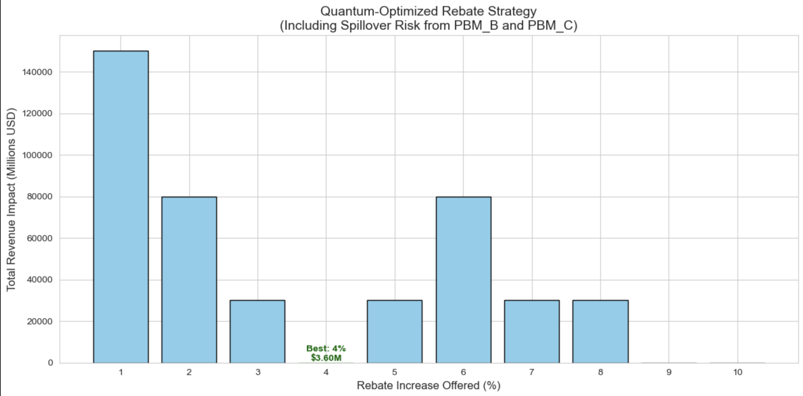

# Quantum Rebate Optimization: PBM Tradeoff Modeling

This notebook implements a quantum-inspired optimization model to evaluate pharmaceutical rebate strategies under real-world market pressures. The example uses a Binary Quadratic Model (BQM) to assess the tradeoff between rebate generosity and the risk of triggering follow-on demands from competing Pharmacy Benefit Managers (PBMs).

## 🔍 Problem Statement

A large PBM is demanding a 10-point rebate increase to retain formulary status for a specialty drug. Other PBMs (representing 27% of market share) are likely to demand similar concessions if the offer is too generous. The goal is to identify the rebate percentage that minimizes **total financial impact**, considering both:

* Direct revenue loss from the rebate
* Indirect exposure to spillover effects from other PBMs

## 🎯 Objective Function

Let:

* $r_i \in \{0, 1\}$: a binary variable for rebate level $i$ from 1% to 10%
* $T_i$: the total financial impact for rebate $i$ (base loss + spillover risk)
* $P$: the penalty weight for enforcing one-hot selection (set to 10,000 in the code)

Then the objective function being minimized is:

$\text{Minimize: } \sum_{i=1}^{10} T_i \cdot r_i + P \cdot \left( \sum_{i=1}^{10} r_i - 1 \right)^2$

**Breaking it down:**

* $\sum T_i \cdot r_i$: the actual **total impact** we want to minimize
* $\left( \sum r_i - 1 \right)^2$: the **one-hot constraint** — only one rebate can be selected
* $P$: a large penalty ensuring the constraint is enforced

## 🧠 In Practice (from code)

Each $T_i$ is computed as:

$T_i = \mathrm{baseLoss}_i + \mathrm{followOnCost}(i)$

Only for $i \geq 9$, the follow-on cost is non-zero.

The quadratic penalty term expands into:

$P \cdot ( \sum r_i - 1 )^2$
Since $r_i^2 = r_i$ for binary variables:

$P \cdot \left( - \sum r_i + 2 \sum_{i < j} r_i r_j + 1 \right)$

This is reflected in the code:

```python
linear[variables[i]] += P             # Adds penalty to each binary variable
quadratic[(r_i, r_j)] = 2 * P         # Enforces exclusivity across pairs
offset = -2 * P + P                   # Normalizes constant terms
```

## 🧪 Example Use Case

This notebook can be used to evaluate whether offering a high rebate (e.g., 10%) is worth the risk of triggering follow-on demands from other PBMs. The cost model captures both direct and indirect financial consequences, and the QUBO formulation enables the problem to be solved using D-Wave’s quantum annealing methods or classical solvers.

## 📋 Repo Structure

```
quantum-rebate-optimizer/
├── README.md             # This file
├── rebate_optimizer.ipynb  # Main Jupyter notebook
├── data/
│   └── inputs.csv        # Sample input cost data
├── results/
│   └── optimal_strategy.json  # Output from last run
├── docs/
│   └── qubo_formulation.pdf   # Math PDF (if LaTeX export desired)
```


## 🔍 Output Example

The plot below illustrates the output of the QUBO optimization: the lowest-energy state corresponds to a 4% rebate increase, yielding the optimal trade-off across base loss, follow-on penalties, and spillover risk from PBM_B and PBM_C.




## 🚀 Future Extensions

* Integrate spillover elasticity modeling
* Test on actual formulary pull-through datasets
* Benchmark D-Wave vs classical solver runtime
* Extend to portfolio-level optimization across multiple drugs

---

Created by Molly Maskrey — Principal Data Scientist, Quantum Healthcare Strategy

